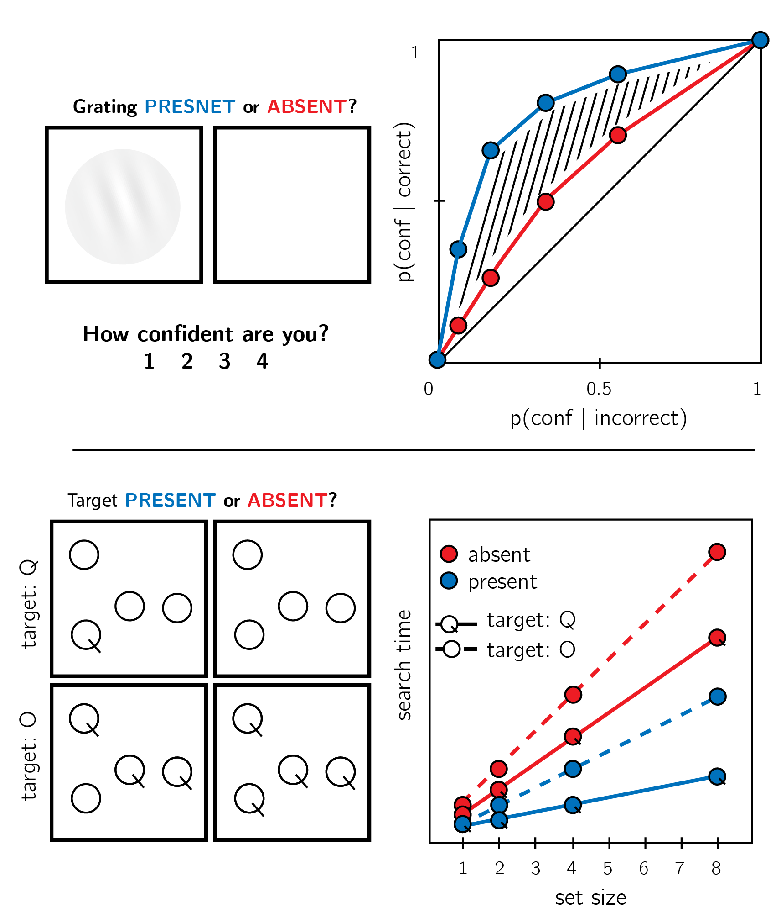
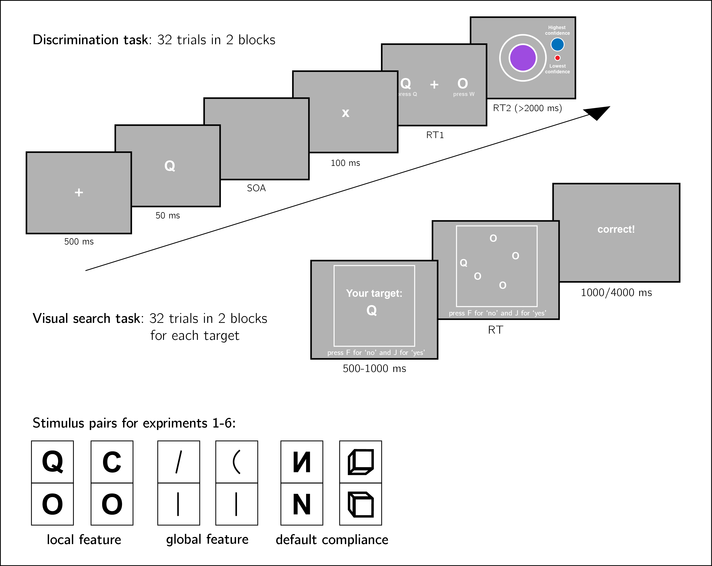

```{r setup, include = FALSE}
library("papaja")
r_refs("r-references.bib")


library('tidyverse')
library('broom')
library('cowplot')
library('MESS') # for AUCs
library('lsr') # for effect sizes
library('pwr') # for power calculations
library('brms') # for mixed effects modeling
library('BayesFactor') # for Bayesian t test
```


```{r analysis-preferences}
# Seed for random number generation
set.seed(42)
knitr::opts_chunk$set(cache.extra = knitr::rand_seed, warning = FALSE)
```

# Introduction

At any given moment, there are many more things that are not there than things that are there. As a result, and in order to efficiently represent the environment, perceptual and cognitive systems have evolved to represent presences, and the absence of objects is implicitly represented as a default state [@oaksford2002contrast; @oaksford2001probabilistic]. One corollary of this is that presence can be inferred from bottom-up sensory signals, but absence is never explicitly represented in sensory channels and must instead by inferred based on top-down expectations about the likelihood of detecting a hypothetical signal, had it been present. This form of higher-order inference-about-absence is known as *argument from epistemic closure*, or *argument from self knowledge* [*If it was true, I would have known it*; @walton1992nonfallacious; @de1988knowing].

<!-- The difficulty in inferring absence from the absence of evidence is common to philosophy [@locke1836essay], statistics [@altman1995statistics] and criminal law [@tuzet2015absence].  -->

Experiments on human subjects accordingly suggest that representing the absence of things is more cognitively demanding than representing their presence, even in simple perceptual tasks. This is evident in slower reactions to stimulus absence than stimulus presence in near-threshold visual detection [@mazor2020distinct], in a general difficulty to form associations with absence [@newman1980feature], and in the late acquisition of the explicit representation of absence in development [e.g., @sainsbury1971feature; @coldren2000asymmetries; for a review on the representation of nothing see @hearst1991psychology]. In this study we focus on two asymmetries in the representation of presence and absence, which manifest at two extremities of the cognitive architecture: feature-level asymmetries in visual search, and metacognitive asymmetries in confidence judgments for near-threshold discrimination.

In visual search, participants report whether a target stimulus appeared or not among distractor stimuli in a search array. Participants typically take longer to identify the absence compared with the presence of a target [e.g., @wolfe1998can]. Furthermore, searching for an object that is marked by a distinguishing feature (for example, searching for a *Q* among *O*s) is more efficient than searching for an object that is marked by the absence of a distinguishing feature [searching for an *O* among *Q*s; @treisman1985search]. This asymmetry at the feature level is evident across both target-present and target-absent trials. In the metacognitive domain, subjective confidence ratings are commonly lower and less reliable for inference about absence, compared to presence [@kanai2010subjective; @meuwese2014subjective; @kellij2018foundations]. Importantly, and in contrast with the visual search benefit for object and feature presence, here the presence/absence asymmetry manifests at the metacognitive evaluation of the decision, instead of the decision itself (see Fig. \@ref(fig:asymmetries)). 


```{r asymmetries, echo=FALSE, fig.cap="Top panel: in visual detection, subjective confidence ratings following judgments about target absence are typically lower, and less correlated with objective accuracy than following judgments about target presence. This metacognitive asymmetry manifests as lower area under the response-conditional ROC curve for 'yes' responses (blue) compared with 'no' responses (red). Lower panel: in visual search, search times are typically slower (and search time/set size slopes shallower) for target absent trials, compared with target present trials. Search time is also slower when searching for a target that is marked by the absence, rather than presence, of a distinguishing feature (for example, searching for an O among Q's)", out.width = '100%'}

```

These perceptual and cognitive presence/absence asymmetries may reflect a profound, common asymmetry in the cognitive representational space, or alternatively a mixture of apparently similar but cognitively unrelated psychological effects. Although such asymmetries are consistently observed across tasks and stimulus features, to date no systematic attempt has been made to investigate whether these similar effects share a common underlying mechanism, or not. Furthermore, it remains a theoretical conjecture whether the presence/absence asymmetry is one instance of a more general perceptual and cognitive asymmetry between default and deviating states in a default-reasoning framework, where absence is only one among many aspects of the default state. Here we take a first step toward answering these two questions by testing the generality of a family of well-documented presence/absence asymmetries both across tasks (visual search and metacognitive evaluations of discrimination judgments), and across representation levels. To achieve this, we make use of the fact that visual search asymmetries are not limited to the presence or absence of local stimulus features like the line that distinguishes a *Q* from an *O*, but are observed for a variety of stimulus pairs, which differ by the presence or absence of a local stimulus features, a global stimulus features, or by a deviation from an expected default state.

The visual search literature is rich in reports of *search asymmetries*, whereby finding a target stimulus among distractors is more efficient that when targets and distractors flip their role. Search asymmetries emerge in stimulus pairs that differ by the presence or absence of a stimulus feature.  These features can be *local* (such as in the *Q* and *O* example describe above), or *global* [like in the case of tilt or curvature;  @treisman1988feature]. Unlike the line that separates a *Q* from an *O*, which is present at a specific location in relation to the stimulus, tilt and curvature are global spatial features, and their presence or absence affects the stimulus as a whole. In addition to search asymmetry for local and global stimulus features, cases of search asymmetry for familiar and unfamiliar objects (with a search time benefit for an unfamiliar target) support an even more general, non-spatial interpretation, in which asymmetries reflect the more efficient processing of a deviation from a default state than the processing of a default-complying signal. For example, searching for an inverted letter among canonically presented letters and searching for a upward-tilted cube among downward-tilted cubes are easier than the inverse searches, in line with a general expectation to see letters in their canonical form, and objects on the ground rather than floating in space [@frith1974acurious; @wang1994familiarity; @von1994visual]. Here, the presence and absence are not of a spatial stimulus feature, but of a more abstract deviation from the expected default state, which can be based on experience and contextual expectations. 

<!-- In line with the proposal that an explicit representation of absence is cognitively demanding and is not available without the active engagement of attention, @treisman1988feature interpreted search asymmetries as revealing a categorical difference between pre-attentive parallel search and attention-guided serial search. According to their account, parallel search is not available when searching for a target that is marked by the absence, or the lesser quantity, of a feature, and when searching for a prototypical stimulus among deviant distractors. According to this account, searching for absence always requires the serial deployment of attention. -->

<!-- Context effects have led @treisman1988feature to further propose that search asymmetry may sometimes reflect a deviation from a default state (also termed null, prototypical, or standard state). This default state is partly hard-coded into the wiring of the system, and partly learned and change according to context. For example, the *Q*-in-*O*/*O*-in-*Q* asymmetry is evident already at 3 months of age, suggesting that it corresponds to a core feature of the perceptual system [@colombo1995visual; @adler2014search]. Other aspects of the default state are sensitive to context and prior experience; for example, searching for a tilted line among vertical distractors is easier than the inverse search, but this effect reverses when the search array is displayed inside a tilted frame [@treisman1988feature].  -->

 

<!-- For example, infants that have been habituated to a display with two *O*s were dishabituated when presented with one *O* and one *Q* (feature addition), but this was not the case for infants that have been habituated to a display of two *Q*s [feature deletion;  -->

That search asymmetries are observed for more abstract stimulus features may place the presence/absence asymmetry within a broader default-reasoning framework with enhanced processing of deviating, compared to default-complying signals, and where object absence is assumed as default. According to this interpretation, cognitive domains in which an asymmetry is observed between object presence and absence should show a similar asymmetry for feature presence and absence, and for unfamiliar and familiar stimuli. Alternatively, feature-level search asymmetries may not at all be related to the overarching cognitive asymmetry between presence and absence, and mark instead the behavioural signature of an independent process. These two options, and the gradient of alternatives between them, entail different prdictions about which of those asymmetries is expected to generalize to other tasks and cognitive domains, and which is expected to be specific to visual search. To test the generality of these effects, here we ask whether similar asymmetries will be evident in a different cognitive domain where presence/absence asymmetry has been documented at the object level: metacognition for near-threshold visual detection judgments. In near-threshold detection, participants report whether a single faint target stimulus appeared, or not. When asked to rate their subjective confidence after making detection decisions, subjective confidence ratings following 'target absent' judgments are commonly lower, and less correlated with objective accuracy, than following 'target present' judgments [@kanai2010subjective; @meuwese2014subjective; @kellij2018foundations; @mazor2020distinct]. Importantly for our study, metacognitive asymmetry manifests in confidence-judgments rather than reaction times, and is not observed for discrimination judgments about the identity of the stimulus, where evidence can be available in support of both responses [e.g., @meuwese2014subjective; @mazor2020distinct]. In this study, we utilize these two facts in our use of metacognitive asymmetry as a marker for the generality of feature-level asymmetries across cognitive faculties.

Different patterns of results could lead to different interpretations of the structure of absence representations. At one end of the spectrum, a complete alignment of metacognitive and search asymmetries across all six stimulus pairs and across participants would indicate a domain-general interpretation of the presence/absence asymmetry. At the other end of the spectrum, metacognitive asymmetries may be restricted to object-level presence and absence, with a symmetric pattern of metacognitive sensitivity for all of our stimulus pairs. Intermediate patterns may extend the search asymmetry to the metacognitive domain only for local stimulus features, or for spatial (local or global) stimulus features but not to default-compliance asymmetries, suggesting that the presence/absence asymmetry cannot be fully reduced to default-state reasoning. 

<!-- Instead of reflecting a higher-order need in counterfactual reasoning for inference about absence, the metacognitive asymmetry can be interpreted as reflecting an asymmetry in the perceptual and cognitive uncertainties that are associated with the representations of presence and absence. For example, @kellij2018foundations successfully replicated the metacognitive asymmetry effect in a simple Signal Detection model with higher variance for the signal distribution. In such Signal Detection models of subjective confidence, decisions are taken based on a single perceptual sample that is drawn from a probability distribution, and confidence is assumed to be proportional to the absolute distance of the perceptual sample from a decision criterion. Assuming unequal variance for the signal and noise distributions, their model did not have to posit any asymmetry in higher-order processes in order to fit the empirical data. -->

<!-- Similarly, probabilistic parallel models of visual search, inspired by Signal Detection Theory, frame search asymmetry effects not as marking a categorical difference between two different search types, but as reflecting the effect of stimulus uncertainty on the noisiness of the search process which is always parallel [@vincent2011search; @dosher2004parallel]. In the context of visual search, participants are assumed to use a noisy perceptual sample to decide whether the visual array included the target stimulus, or not. @vincent2011search demonstrated that differences in search efficiency can be accounted for by the relative difference in internal uncertainty associated with the two stimulus categories. He found support for his unequal-variance account in the slope of standardized ROC curves, extracted from subjective confidence estimates in a vertical/tilted visual search task with briefly presented (94 ms) search arrays. According to his analysis, the advantage for tilted-in-vertical compared with vertical-in-tilted search can reflect the higher perceptual uncertainty that is associated with tilted (feature present) stimuli, compared with vertical (feature absent) ones. Similarly, reverse correlation analysis revealed higher variability in the internal representation of *Q* (feature present), compared to *O* (feature absent) stimuli [@saiki2008stimulus]. In contrast, @dosher2004parallel used a speed accuracy trade-off (SAT) method to compare the predictions of parallel and serial models of visual search asymmetry for *C* and *O*. A model-comparison favored a probabilistic parallel model for both search types, but in contrast with the results of @vincent2011search the error probabilities in the winning model were consistent with an unequal-variance SDT model in which the *C* (feature present) distribution was marked by a *lower* standard deviation than the *O* (feature absent) distribution.  -->

<!-- The unequal variance interpretation may not be mutually exclusive to the proposal that search and metacognitive asymmetries reflect a qualitative difference between feature-positive and feature-negative representations. As pointed out by @treisman1988feature, and in line with Weber's law and with the noise profile of biological neurons, the positive representation of features and objects may be more variable, or noisy, than the representation of their absence. The unequal variance identified by signal detection models may be based in this qualitative difference between the two classes of representation. Furthermore, a parallel search model may account for search asymmetry for presentation times below the time taken to complete a saccade, but an additional level of asymmetry, governed by endogenous attention mechanisms, may be necessary to account for search times in natural displays that are not limited in time. Finally, it is not clear that search asymmetry for different stimulus types originates from the same underlying mechanism. Different mechanisms may explain search asymmetry for local features (e.g., *Q*/*O*), global features (e.g., tilt or curvature), and familiarity-based asymmetries (e.g., inverted letters). Specifically, there is currently no evidence available to support an unequal-variance account for context- and experience-dependent asymmetries, such as the one observed for inverted letters. -->


<!-- Second, with confidence ratings in single-item discrimination we will get a measure of the relative variability for the two stimulus types that is independent of visual search. This measure can then inform and constrain theories of search asymmetry, and more specifically support or rule out theories that rely on unequal-variance assumptions to explain search time differences. -->


<!-- A third interpretation of the search-asymmetry phenomenon is that some asymmetries reflect a confounded asymmetry in the experimental design, rather than a true cognitive asymmetry in the processing of the two stimulus types [@rosenholtz2001search]. One source of experimental asymmetry that is often neglected is that of the background. Rosenholtz pointed to the fact that the background is often more similar to one of the stimulus types (for example, the background is upright and not tilted, or gray and not chromatic). As a result, the background intervenes with the search process more in one condition compared to the other. In other cases, two search tasks may seem symmetric when assuming one representational space, but asymmetry is revealed when considering alternative ones. This is the case of fast and slow oscillating targets: the two are symmetric when represented on a speed/direction coordinate system, but an asymmetry emerges when plotting the distractor and targets in two-dimensional velocity space. -->


<!-- This gradual effect of variance ratio is not specific to parallel models of visual search. Sensitivity of search slope to variability in internal representations is also predicted by two-stage accounts of visual search. For example, @treisman1988feature relied on Weber's law to show that searching for a target that induces increased activity compared to distractors is more efficient than searching for a target that induces weaker activity, due to differences in the underlying noise level.  -->

<!-- This compelling and elegant reduction of visual-search asymmetry to differences in noise-levels between the two perceptual categories has been challenged by participants' subjective ratings of mental effort for feature-positive and feature-negative searches. Subjective global workload ratings were higher when participants searched for an *O* among *Q*s than in the inverse search [@finomore2006effects]. -->


<!-- decide between two competing models: a first-order model in which asymmetry is the result of differences in signal variance between thw two perceptual categories, and a second-order attention monitoring model in which feature-positive and feature-negative searches are assumed to recruit a different set of cognitive machinery. In the following sections we will describe the two models. We will then describe our proposed tasks, and illustrate the predictions made by the two models for these tasks. -->

<!-- go no go asymmetry: @helton2011feature @stevenson2011search -->


<!-- ## Uncertainty-based model -->

<!-- Asymmetries in decision-making can originate from different levels of noise, or uncertainty, associated with different stimulus categories. In perceptual detection for example, signal-present trials are commonly modeled as being noisier than signal-absent trials (in Signal Detection Theory, SDT, this means they are sampled from a wider distribution). This *unequal variance* model is supported by evidence from studies that incorporate subjective confidence judgments or criterion manipulations to reconsruct a receiver operating characteristic (ROC) curve.  -->

<!-- The application of Signal Detection Theory to psychophysics is limited to explain accuracy, bias and subjective confidence, but does not make any predictions about the temporal unfolding of the decision process. In order to account for response-time differences as a function of relative uncertainty, we extend this SDT model to time in a Drift Diffusion Model (DDM) framework. On every time step, a perceptual sample is obtained from a probability distribution, centered at 1 for category A and at -1 for category B. Similar to a standard DDM, over time perceptual samples are accumulated until the overall sum reaches one of two thresholds. The participant responds A if the accumulated evidence had crossed the upper threshold, and B if it was the lower threshold that has been crossed. The position of the threshold affects response speed (a threshold farther away from the starting point will take longer to reach) and accuracy (a threshold farther away from the starting point will be less likely to be crossed by mistake). The position of the starting point affects response bias: starting closer to the upper threshold will make A responses faster and more likely, and starting closer to the lower threshold will make B responses faster and more likely. Importantly, in this unequal-variance drift-diffusion model, the level of noise is dependent on the presented stimulus. For example, stimuli from category A may be associated with a noisier diffusion process than stimuli from category B. -->

<!-- In a standard DDM with equal variance, the error rate is minimized when the starting point (bias) is set to 0, equally distant from the upper and lower thresholds. In contrast, in the unequal-variance drift-diffusion model the error rate is minimized when the starting point is closer to the threshold associated with the high-variance category. This is true for all placements of a threshold. For example, here we simulated a drift diffusion process with a drift rate of 1. The variance for the negative category was set to 0.5, and the variance for the positive category was set to 1. We simulated 10,000 trials for different choices of threshold and starting point. Similar to a standard equal-variance DDM, accuracy is maximized when the threshold is set to high values (showing as bright values at the top of the heat map). However, unlike equal-variance DDM here accuracy is maximized when the accumulation process is biased to start closer to the high-variance (here positive) threshold (showing as more bright values at the right side of the heat map). -->

<!--  -->

<!-- As a result of this systematic shift of the starting point, responses to the high-variance category will be faster on average than responses to the low-variance category. We use this qualitative observation from our model to draw a link between stimulus-specific perceptual uncertainty and the time taken to identify a stimulus. We then apply this drift-diffusion model of perceptual discrimination to out three tasks, to make qualitative predictions. -->

<!-- ### Confidence in discrimination -->

<!-- The basic (non temporal) unequal-variance Signal Detection model predicts a better alignment of subjective confidence with objective accuracy (measured as the area under the response-conditional type-2 ROC curve) for responses in which the stimulus was decided to be of the high-variance compared to the low-variance category. For example, in detection this means that confidence following judgments about stimulus presence will separate hits from false alarms better than confidence following judgments about stimulus absence will separate correct rejections from misses.  -->

<!-- ### Visual search -->

<!-- For simplicity, we model visual search as an exhaustive serial process, where attention is directed to items in random order, without repetition. Once an item reaches attention a drift diffusion process commences, until a threshold is reached. The visual search trial ends with a 'target present' response as soon as an item is identified as target, otherwise a 'target absent' response is given once all items have been identified as distractors. This naive visual search model, in conjunction with the unequal-variance assumption about stimulus-specific uncertainty, predicts a steeper search slope for searching the low-variance stimulus compared to the high-variance stimulus, both for target-present and for target-absent trials. This is true both for target-present and for target-absent trials.  -->

<!-- In our demo simulation, high-variance stimuli are associated with variance of 1, and low variance stimuli are associated with variance 0.8. Our agent positioned their threshold and starting point to minimize average response time, while maintaining accuracy > 0.95. For these stimulus-specific variance values, this means setting the threshold to 0.7 and the bias to 0.3. -->


<!-- Over the years researchers proposed different theoretical accounts for this phenomenon. @treisman1985search proposed that visual search is more efficient when searching for the presence, rather than the absence, of a stimulus feature. According to this account, the letter *Q* is marked by an additional feature (a diagonal line) compared to the baseline *O*. Similarly, blue is present in magenta but absent in red. @treisman1988feature then used search-asymmetry as a litmus test for what counts as presence and what counts as absence in early vision. For example, the fact that *C*-in-*O* search is easier than *O*-in-*C* search was used as evidence for that 'free ends', rather than shape-closeness, are positively encoded in vision. Contextual effects have led @treisman1988feature to further propose that search asymmetry can in some cases originate from a deviation from a default state (also termed null, prototypical, or standard state). This standard state is affected by prior knowledge and available context, for example searching for a tilted line among vertical distractors is easier than the inverse search, but this effect reverses when the search array is displayed inside a tilted frame [@treisman1988feature]. The contents of the default state are partly hard-coded into the wiring of the system (like in the case of color) and partly affected by expectations that are sensitive to context and prior experience [like in the cases of viewing direction or familiarity with letters; @von1994visual; @wang1994familiarity].  -->


<!-- Search asymmetry has been linked to other perceptual and cognitive asymmetries, such as asymmetric similarity judgments [@rosch1975cognitive], the feature-positive-effect in reinforcement learning [@jenkins1970discrimination], and the addition/deletion asymmetry in change-detection [@agostinelli1986detecting]. Here we wish to examine the relation between search asymmetry and an asymmetry in subjective confidence ratings in detection and detection-like judgments.  -->

<!-- By triangulating the feature-level asymmetry across six features and two tasks, we aim to obtain a better understanding of feature-level asymmetries, and to determine whether these asymmetries originate from identical, partly overlapping, or completely distinct mechanisms. We will test the hypothesis that these asymmetries result from differences in the shape of the underlying signal distributions for the two stimulus categories.  -->

# Methods

We report how we determined our sample size, all data exclusions (if any), all manipulations, and all measures in the study. <!-- 21-word solution (Simmons, Nelson & Simonsohn, 2012; retrieved from http://ssrn.com/abstract=2160588) -->


## Participants

The research complies with all relevant ethical regulations, and was approved by the Research Ethics Committee of University College London (study ID number 1260/003). Participants will be recruited via Prolific, and will give informed consent prior to their participation. They will be selected based on their acceptance rate (>95%) and for being native English speakers. For each of the six experiments, we will collect data until we reach 320 included participants (after applying our pre-registered exclusion criteria). The entire experiment will take 15 minutes to complete (median completion time in our pilot data: 13.5 minutes). Participants will be paid £2 for their participation, equivalent to an hourly wage of £8.


<!-- Multi-level MCMC simulations, assuming an average correlation of 0.29 across the six tasks between search and metacognitive asymmetries, indicated a statistical power of 97% to reject the null hypothesis for Hypothesis 2.   -->


## Procedure

Experiments will be identical, except for the identity of the target and distractor stimuli. In what follows we will describe the procedure for the stimulus pair '*Q*' and '*O*'.  Experiments were programmed using the jsPsych and P5 JavaScript packages [@de2015jspsych;@mccarthy2015p5], and hosted on a JATOS server [@lange2015just]. The full Experiment as delivered to participants is available here: [http://167.99.93.4/publix/13/start?batchId=45&generalMultiple](http://167.99.93.4/publix/13/start?batchId=45&generalMultiple). 

The Experiment will comprise three parts ("challenges") presented in pseudorandomized order. 

1. The first part will comprise 32 visual search trials. In these trials participants will search for one '*Q*' in an array of 1, 2, 4 or 8 '*O*' distractors. The target stimulus will be present in half of the trials, and absent in the other half. Participants will be instructed to use their keyboard to indicate whether the target was present (press J) or absent (press F) as quickly and accurately as possible. Each trial will start with an instruction screen, indicating the search target (500-1000 ms), followed by the presentation of the search array. The search array will remain visible until a response is recorded. Feedback about accuracy will be delivered. To motivate accurate responses, the feedback screen will remain for 1000 ms following correct responses and for 4000 ms following incorrect responses. The visual search block will start with four practice trials of distractor set-size 4 that will not be included in the final analysis. The actual block of 32 trials (4 trials of each set size, presented in random order) will start once all four practice trials are answered correctly, otherwise additional practice trials will be delivered.

2. The second part will be identical to the first part, except for the identity of the target stimulus. Here '*O*' will server as target and '*Q*' as distractor.

3. In the third part, participants will make discrimination judgments between masked *Q* and *O* stimuli, and rate their subjective decision confidence on a continuous scale. After a fixation cross (500 ms), the target stimulus will be presented in the center of the screen for 50 ms, followed by a mask (100 ms). Stimulus onset asynchrony will be calibrated online in a 1-up-2-down procedure [@levitt1971transformed], with a multiplicative step factor of 0.9, and starting from 30 milliseconds. Participants will then use their keyboard to make a discrimination judgment. Following their response, subjective confidence ratings will be given on an analog scale by controlling the size of a colored circle with the computer mouse. High confidence will be mapped to a big, blue circle, and low confidence to a small, red circle. The confidence rating phase will terminate once participants click their mouse, but not before 2000 ms. No feedback will be delivered about accuracy. 

```{r trialstructure, echo=FALSE, fig.cap= "Experiment structure. Three experimental parts will be delivered in pseudorandomized order: a discrimination task with subjective confidence ratings, and two visual search tasks with different distractor/target assignments. Asymmetry effects will be tested for six stimulus features in six separate experiments.", out.width = '100%'}

```


We will test the following stimulus features in separate experiments with different participants (Fig. \@ref(fig:trialstructure)):

1. **Local feature: Addition of a stimulus part**. *Q* and *O* will be used as stimuli [@treisman1985search].
2. **Local feature: Open ends**. *C* and *O* will be used as stimuli  [@treisman1985search; @takeda2000inhibitory; @treisman1988feature].
3. **Global feature: Curvature**. Straight and curved lines will be used as stimuli [@treisman1988feature].
4. **Global feature: Orientation**. Vertical and tilted lines will be used as stimuli [@treisman1988feature].
5. **Default compliance: Letter inversion**. Reversed and normal *N* will be used as stimuli [@frith1974acurious; @wang1994familiarity].
6. **Default compliance: Viewing angle**. Upward and Downward tilted cubes will be used as stimuli [@von1994visual].


### Randomization

The order and timing of experimental events will be determined pseudo-randomly by the Mersenne Twister pseudorandom number generator, initialized in a way that ensures registration time-locking [@mazor2019novel]. 

## Data analysis

We will use `r cite_r("r-references.bib", pkgs=c('BayesFactor','broom','ggplot2','cowplot','dplyr','papaja','tidyr','brms'), withhold=FALSE)` for all our analyses.

We will test the following hypotheses: 

1. **Hypothesis 1 (REPLICATION)**: For our selected stimulus pairs, visual search is more efficient in one direction compared with the other.

This hypothesis will be tested for the following stimulus features for which search asymmetry has been demonstrated: addition of a stimulus part (visual search is more efficient for Q-in-O than for O-in-Q search), open ends (more efficient for C-in-O than for O-in-C search), orientation (more efficient for tilted-in-vertical than for vertical-in-tilted search), curvature (more efficient for curved-in-straight than for straight-in-curved search), letter inversion (more efficient for inverted-in-canonical than for canonical-in-inverted search), and viewing angle (more efficient for upward-in-downward tilted than for downward-in-upward-tilted search). We will test Hypothesis 1 separately for each stimulus feature, by replicating the original search asymmetry.

2. **Hypothesis 2 (TASK-GENERALITY)**: Conditioned on the results of our testing of Hypothesis 1. Metacognitive asymmetry, measured as the area between the two response conditional ROC curves in a discrimination task (see methods section below), follows the same direction as search asymmetry. 

For each of the six stimulus pairs, we will test the the null hypothesis that metacognitive sensitivity (measured as the area under the response conditional ROC curve) for the efficient target (e.g., *Q*) is equal to or lower than metacognitive sensitivity for the inefficient target (e.g., for the case of *Q*/*O*, $H_o=auROC_{Q}\leq auROC_O$). 

<!-- 2. **Hypothesis 2**: Response-inhibition asymmetry, measured with the Go/No-go task,  follows the same direction as search asymmetry.  -->

<!-- This hypothesis will be tested separately for the same six stimulus features. We will test Hypothesis 2 separately for each stimulus feature, by replicating the original search asymmetry (for example, Q-in-O search is more efficient that O-in-Q search) and testing the null hypothesis that response-inhibition (measured as  Go/No-go accuracy) when the efficient target (e.g., *Q*) is used as a go-signal, is equal to or lower than response-inhibition for when the inefficient target is used as a go-signal (e.g., for the case of *Q*/*O*, $H_o=Acc_{Q}\leq Acc_O$).  -->

3. **Hypothesis 3 (TASK-CORRELATION)**: Individual differences in the direction and magnitude of search asymmetry positively covary with individual differences in the direction and magnitude of metacognitive asymmetry. 

This hypothesis will be tested separately for each stimulus pair by measuring the Pearson correlation between search asymmetry and metacognitive asymmetry across participants. We will also measure the overall correlation between search and metacognitive asymmetries across participants, pooled from all 6 experiments.

4. **Hypothesis 4 (SEARCH-CORRELATION)**: Individual differences in the direction and magnitude of search asymmetry positively covary with individual differences in the additional time cost for reporting target absence in visual search. 

This hypothesis will be tested separately for each stimulus pair by measuring the Pearson correlation between search asymmetry and the time cost of reporting target absence, across participants. We will also measure the overall correlation between these two measures across participants, pooled from all 6 experiments.

<!-- 3. **Hypothesis 3** (conditioned on the results of Hypothesis 2): The positive association between search- and metacongitive- asymmetries is mediated by the sigma-ratio, extracted from confidence ratings in the discrimination task. -->

<!-- The sigma-ratio is a measure of the relative variance for the two stimulus types, that will be estimated from the zROC slopes extracted from confidence ratings in the discrimination task [@wickens2002elementary section 3.4]. This hypothesis will be tested by comparing the correlation between search and metacognitive asymmetries with the part correlation, after removing variance that is explained by the sigma-ratio from the metacognitive asymmetry score.  -->

For each stimulus pair, Hypothesis 2 (TASK-GENERALITY) will test the extent to which the asymmetry is unique to visual search, or otherwise generalizes to an independent measure of presence/absence asymmetry from metacognitive evaluations. Hypothesis 3 (TASK-CORRELATION) will build on and strengthen findings favouring a shared mechanism, by testing for shared variance between the two independent measures across participants. Finally, Hypothesis 4 (SEARCH-CORRELATION) will test whether, for each of our stimulus pairs, feature-level asymmetries are correlated with object-level asymmetries between 'present' and 'absent' responses. This will serve to test the more general idea that feature-level asymmetries are related to explicit decisions about the presence or absence of objects. 

### Rejection criteria

Participants will be excluded for performing below 70% accuracy in one or two of the search tasks, for performing below 60% accuracy in the discrimination task, for having extremely fast or slow reaction times in one or more of the tasks (below 250 milliseconds or above 5 seconds in more than 25% of the trials), and for failing the comprehension check. For the response-conditional ROC analysis, only participants that committed at least one error of each error type (for example, mistaking a *Q* of *O* and mistaking an *O* for *Q*), will be included. 

Trials with response time below 250 milliseconds or above 5 seconds will be excluded.

Only correct visual search trials will be analyzed.

### Dependent variables and analysis plan

The following measures will be extracted for each participant:

1. The difference between the area under the response-conditional type-2 ROC curves for the two responses [e.g., '*Q*' and '*O*']: $\Delta_m$. 

Response conditional ROC curves will be extracted, by plotting the empirical cumulative distribution of confidence ratings for correct responses against the same cumulative distribution for incorrect responses. This will be done separately for the two responses, resulting in two curves. The area under the response-conditional ROC curve is a measure of metacognitive sensitivity. The area between the two curves is a measure of metacognitive asymmetry [@meuwese2014subjective]. This difference will be used to test Hypothesis 2 (TASK-GENERALITY).

2. The difference between search slopes for the two visual search tasks: $\Delta_s$. 

For each visual search task, the slope will be extracted for target present and target absent trials separately (correct trials only), and the average value will be taken. The difference between these average slopes is a measure of search asymmetry. This difference will be used to test Hypotheses 1 (REPLICATION) and 2 (TASK-GENERALITY). 

4. The relative difference between the area under the response-conditional type-2 ROC curves for the two responses ($\Delta^{rel}_m$) will be defined as the area between the two curves, divided by the sum of the areas under the two curves. 

This relative difference will be used to test Hypothesis 3 (TASK-CORRELATION).

5. The relative difference between search slopes for the two visual search tasks ($\Delta^{rel}_s$) will be defined as the difference between the two search slopes, divided by the sum of their absolute values. 

This relative difference will be used to test Hypotheses 3 (TASK-CORRELATION) and 4 (SEARCH-CORRELATION).

6. The relative difference between search slopes for the two visual search responses: $\Delta^{rel}_{r}$. 

For each visual search response ('present' and 'absent'; correct trials only), the slope will be extracted for the two stimulus assignments separately, and the average value will be taken. The relative difference between search slopes for the two visual search responses ($\Delta^{rel}_{r}$) will be defined as the difference between the two search slopes, divided by the sum of their absolute values. 

This relative difference will be used to test Hypothesis 4 (SEARCH-CORREALTION).

<!-- 5. The sigma-ratio ($Q_\sigma$) will be defined as the ratio between the estimated variance associated with the feature-positive (or deviant) and feature-negative stimuli. -->

<!-- The sigma-ratio will be estimated for each participant, in the following way. First, a zROC curve will be extracted from the confidence and response data in the discrimination task. Then, a linear regression model with free slope and intercept parameters will be fit to the zROC curve, to estimate its slope. The slope of the zROC curve will be then taken as an estimate of the relative variance associated with the two stimulus types [@wickens2002elementary].  -->

For each of the six experiments, Hypothesis 1 (REPLICATION) will be tested using a two tailed t-test at the group level with $\alpha=0.05$.


<!-- In addition, a two one-sided equivalence test [TOST procedure; @schuirmann1987comparison] will be adopted to test the null hypothesis that $|\Delta_s|$ is higher than the smallest effect size of interest (1 millisecond/item).  -->

Conditioned on that search asymmetry will be replicated, for each of the six experiments, Hypothesis 2 (TASK-GENERALITY) will be tested using a one tailed t-test at the group level with $\alpha=0.05$.
<!-- In addition, a two one-sided equivalence test [TOST procedure; @schuirmann1987comparison] will be adopted to test the null hypothesis that $|\Delta_m|$ is higher than the smallest effect size of interest (0.05 in AUC units, ranging from 0 to 1).  -->

Hypothesis 3 (TASK-CORRELATION) will be tested for each experiment by testing the Pearson correlation between $\Delta^{rel}_m$ and $\Delta^{rel}_s$, across participants. We will also test the Pearson correlation between $\Delta^{rel}_m$ and $\Delta^{rel}_s$ pooled across participants from all 6 experiments, and controlling for experiment-specific intercept effects (by mean-centering both variables at the experiment level prior to computing a correlation).  

Hypothesis 4 (RESPONSE-GENERAL) will be tested for each experiment by testing the Pearson correlation between $\Delta^{rel}_s$ and $\Delta^{rel}_r$, across participants. We will also test the Pearson correlation between $\Delta^{rel}_s$ and $\Delta^{rel}_r$ pooled across participants from all 6 experiments, and controlling for experiment-specific intercept effects. 

For hypotheses 1 (REPLICATION) and 2 (TASK-GENREAL), in case of a null result, a Bayes factor will be computed using the BayesFactor R package [@morey2015package] and using a Jeffrey-Zellner-Siow Prior with a medium rscale parameter of $\sqrt{2}/2$. For hypotheses 3 (TASK-CORREALTION) and 4 (SEARCH-CORRELATION), in case of a null result, the BayesFactor package will be used to compute a Bayes factor using a shifted, scaled beta(3,3) prior distribution for the correlation. 

<!-- In addition, a two one-sided equivalence test [TOST procedure; @schuirmann1987comparison] will be adopted to test the null hypothesis that $|r(\Delta^{rel}_m, \Delta^{rel}_s)|$ is higher than the smallest effect size of interest (0.05 in correlation units, ranging from -1 to 1).  -->

<!-- Conditioned on that we observe a significant result for Hypothesis 2, we will test Hypothesis 3 by comparing the correlation $r(\Delta^{rel}_s, \Delta^{rel}_m)$ and the part-correlation after regressing out the contribution of the sigma ratio to the metacognitive asymmetry $r(\Delta^{rel}_s, \Delta^{rel}_m.log(Q_\sigma)$. The comparison between the two correlations will be carried out using the Hotelling-Williams test for comparing dependent correlations [@williams1959comparison]. In case of a null result, a two one-sided test [TOST procedure; @schuirmann1987comparison] will be adopted to test the null hypothesis that $|r(\Delta^{rel}_s, \Delta^{rel}_m)-r(\Delta^{rel}_s, \Delta^{rel}_m.log(Q_\sigma)|$ is higher than the smallest effect size of interest (0.05).  -->

### Statistical power

Statistical power calculations were performed using the R-pwr package [@R-pwr].

1. Hypothesis 1 (REPLICATION): With 320 participants, we will have a statistical power of 95% to detect effects of size `r pwr.t.test(power=0.95,n=318,sig.level=0.05, type='paired')%>%'$'(d)`, which is less than a fifth of the standardized effect size we observed for search slopes in our pilot sample. 

2. Hypothesis 2 (TASK-GENERALITY): With 320 participants, we will have a statistical power of 95% to detect effects of size `r pwr.t.test(power=0.95,n=318,sig.level=0.05, type='paired', alternative='greater')%>%'$'(d)`, which is less than a half of the standardized effect size we observed for metacognitive asymmetry in our pilot sample. 

3. Hypothesis 3 (TASK-CORRELATION): For each stimulus pair, will have a statistical power of 95% to detect a Pearson correlation of `r pwr.r.test(power=0.95,n=318,sig.level=0.05)%>%'$'(r)` between search and metacognitive asymmetries. Across all six stimulus pairs, we will have a statistical power of 95% to detect a Pearson correlation of `r pwr.r.test(power=0.95,n=318*6,sig.level=0.05)%>%'$'(r)`. 

4. Hypothesis 4 (SEARCH-CORRELATION): For each stimulus pair, will have a statistical power of 95% to detect a Pearson correlation of `r pwr.r.test(power=0.95,n=318,sig.level=0.05)%>%'$'(r)` between search type and search response asymmetries. Across all six stimulus pairs, we will have a statistical power of 95% to detect a Pearson correlation of `r pwr.r.test(power=0.95,n=318*6,sig.level=0.05)%>%'$'(r)`. 

<!-- 3. Hypothesis 3: Using Monte-Carlo simulations, we estimate a statistical power of 0.97 to test Hypothesis 3 at the single-experiment level, assuming a modest correlation of 0.2 between $Q_\sigma$ and $\Delta^{rel}_m$, and assuming that the correlation between $\Delta^{rel}_m$ and $\Delta^{rel}_s$ is completely mediated by $Q_\sigma$. -->

## Data availability

All raw data will be made fully available on OSF and on the study's GitHub respository: https://github.com/matanmazor/asymmetry. 
Pilot data is available at: https://github.com/matanmazor/asymmetry/blob/master/Experiments/Q_in_O/results/pilot/jatos_results_batch3.csv

## Code availability

All analysis code will be openly shared on the study's GitHub repository: https://github.com/matanmazor/asymmetry. For complete reproducibility, the RMarkdown file used to generate the final version of the manuscript, including the generation of all figures and extraction of all test statistics, will be available on our GitHub repository.


## Acknowledgements

## Author contributions

## Competing interests

The authors declare no competing interests.

## Table 1: Design Table
| Question                                                                           | Hypothesis                                                                                                                                                                                                                                                                            | Sampling Plan                                                                                                                                                                                                           | Analysis Plan                                                                                                                                                                                                                                                                                   | Interpretation given to different outcomes                                                                                                                                                                                                                                                                                                                                                                                                                                                   |
|------------------------------------------------------------------------------------|---------------------------------------------------------------------------------------------------------------------------------------------------------------------------------------------------------------------------------------------------------------------------------------|-------------------------------------------------------------------------------------------------------------------------------------------------------------------------------------------------------------------------|-------------------------------------------------------------------------------------------------------------------------------------------------------------------------------------------------------------------------------------------------------------------------------------------------|----------------------------------------------------------------------------------------------------------------------------------------------------------------------------------------------------------------------------------------------------------------------------------------------------------------------------------------------------------------------------------------------------------------------------------------------------------------------------------------------|
| Replication: search asymmetry                                                      | Visual search is more efficient when searching for the presence rather than the absence of a feature, or when searching for a non-default target among default distractors rather than vice versa.                                                                                    | 320 included participants in each experiment $\times$ 6 experiments. We will have 95% power to detect an effect size of 0.2.                                                                                            | T test on $\Delta_m$ against 0. If p>0.05, compute Bayes factor with JZS prior (rsacle=0.707).                                                                                                                                                                                                  |                                                                                                                                                                                                                                                                                                                                                                                                                                                                                              |
| Does metacognitive asymmetry extend to sub-stimulus features?                      | Metacognitive asymmetry, measured as the area between the two response conditional ROC curves, follows the same direction as search asymmetry.                                                                                                                                        | 320 included participants in each experiment $\times$ 6 experiments. We will have 95% power to detect an effect size of 0.2.                                                                                            | Conditioned on a significant effect for H1: T test on $\Delta_m$ against 0.  If p>0.05, compute Bayes factor with JZS prior (rscale=0.707).                                                                                                                                                     | For each experiment separately, a significant result in the expected direction would be interpreted as metacognitive asymmetry for the specific stimulus feature.  Across all experiments, a series of significant results in the expected direction would be interpreted as supporting a common underlying mechanism for search and metacognitive asymmetries.  $BF_{0,1}\geq10$ would be interpreted as indicating indistinguishable metacognitive sensitivity for the two stimulus types. |
| Is there a common source to metacognitive and search asymmetries?                  | Individual differences in the direction and magnitude of search asymmetry positively covary with individual differences in the direction and magnitude of metacognitive asymmetry.                                                                                                    | 320 included participants in each experiment $\times$ 6 experiments. We will have 95% power to detect a correlation of 0.2 at the single experiment level, and a correlation of 0.08 pooled across all six experiments. | Pearson correlation between $\Delta^{rel}_m$ and $\Delta^{rel}_s$ at the single experiment level, and pooled across all six experiments after regressing out the effect of experiment on both measures.  IF p>0.05, a compute Bayes factor with a shifted, scaled beta distribution (a=3, b=3). | For each experiment separately, a significant correlation would be interpreted as a common cause for the two asymmetries for the particular stimulus pair. Pooled across all six experiments, a significant correlation would be interpreted as reflecting a common cause for search and metacognitive asymmetries generally. $BF_{0,1}\geq10$ would be interpreted as evidence against a common mechanism underlying the two asymmetries.                                                   |
| Is there a common source to search asymmetries at the feature and stimulus levels? | Individual differences in the direction and magnitude of search asymmetry for the two stimulus assignments positively covary with individual differences in the direction and magnitude of the relative difference in search slope for 'target absent' and 'target absent' responses. | 320 included participants in each experiment $\times$ 6 experiments. We will have 95% power to detect a correlation of 0.2 at the single experiment level, and a correlation of 0.08 pooled across all six experiments. | Pearson correlation between $\Delta^{rel}_m$ and $\Delta^{rel}_s$ at the single experiment level, and pooled across all six experiments after regressing out the effect of experiment on both measures.  IF p>0.05, a compute Bayes factor with a shifted, scaled beta distribution (a=3, b=3). | For each experiment separately, a significant correlation would be interpreted as a common cause for the two asymmetries for the particular stimulus pair. Pooled across all six experiments, a significant correlation would be interpreted as reflecting a common cause for feature-level and stimulus-level search asymmetries generally. $BF_{0,1}\geq10$ would be interpreted as evidence against a common mechanism underlying the two asymmetries.                                    |
<!-- Hypothesis 2 (search and metacognitive asymmetries covary) will be tested globally for the 6 experiments by fitting a mixed-effects linear model using the `brms` package [@burkner2016package]. The following mixed-effects linear model will be fitted to the data: $\Delta^{rel}_s \sim 1+\Delta^{rel}_m+(1+\Delta^{rel}_m | exp)$ where $exp$ denoted the specific experiment in which the subject participated. The population-level coefficient for $\Delta^{rel}_s$ will be compared against 0. We will conclude that the two effects are correlated at the population level if the lower bound of the 95% credible interval for this coefficient will by higher than 0.05. We will conclude that the correlation falls within our Region of Practical Equivalence [@kruschke2013much] if the entire credible interval will fall within  the region $[-0.05, 0.05]$.  -->


\newpage

# References

\begingroup
\setlength{\parindent}{-0.5in}
\setlength{\leftskip}{0.5in}

<div id="refs" custom-style="Bibliography"></div>
\endgroup

\newpage

# Supplementary information

# Pilot data and analysis

## Pilot Experiment

```{r load_pilot_data, echo=FALSE, cache=TRUE}

df <- read_csv('../Experiments/Q_in_O/results/pilot/jatos_results_batch3.csv') %>%
  rename('subj_id' = 'subject_identifier') %>%
  mutate(subj_id=factor(subj_id))

N_total <- df$subj_id%>%unique()%>%length()

search_df <- df %>%
  filter((test_part=='Q_in_O_vs') | (test_part=='O_in_Q_vs')) %>%
  select('subj_id','test_part','set_size','target_present','correct','RT') %>%
  mutate(target= ifelse(test_part=='Q_in_O_vs', 1, 2),
         response = ifelse(correct==1, target_present, 1-target_present)) %>%
  mutate(target= factor(target, levels=c(1,2)),
                        response = factor(response,levels=c(0,1)),
         trial = sequence(rle(as.character(subj_id))$lengths))

disc_df <- df %>%
  filter((test_part=='disc')) %>%
  select('subj_id','which_stimulus','SOA','correct','RT','confidence','conf_RT') %>%
  mutate(response = ifelse(correct==1, which_stimulus, 3-which_stimulus)) %>%
  mutate(response= factor(response, levels=c(1,2)),
         which_stimulus = factor(which_stimulus, levels=c(1,2)))

minRT <- 250
maxRT <- 5000
min_acc_search <- 0.7
min_acc_disc <- 0.6

##exclude subjects
bad_search <- search_df %>%
  group_by(subj_id,target) %>%
  summarise(acc = mean(correct),
            RTlow = quantile(RT,0.25),
            RThigh = quantile(RT,0.75))%>%
  filter(acc<min_acc_search | RTlow<minRT | RThigh>maxRT) %>%
  select('subj_id')

bad_disc <- disc_df %>%
  group_by(subj_id) %>%
  summarise(acc = mean(correct),
            RTlow = quantile(RT,0.25),
            RThigh = quantile(RT,0.75))%>%
  filter(acc<min_acc_disc | RTlow<minRT| RThigh>maxRT) %>%
  select('subj_id')

failed_test <- df %>%
  group_by(subj_id) %>%
  summarise(fi=all(followed_instructions)) %>%
  filter(fi==FALSE) %>%
  select('subj_id')

excluded <- union(failed_test,union(bad_disc,bad_search))
 N <- N_total-length(excluded$subj_id)
 
Newman_df <- read_csv('../Experiments/Newman1980/results/3_item_pilot/jatos_results_batch1.csv') %>%
  rename('subj_id' = 'PROLIFIC_PID') %>%
  mutate(subj_id=factor(subj_id))

Newman_N_total <- Newman_df$subj_id%>%unique()%>%length()
```

`r N_total` participants were recruited from Prolific for our pilot experiment. We followed the procedure described in the Methods section, using *Q* and *O* as our stimuli. The experiment took about 10 minutes to complete. Subjects were paid £1.25 for their participation. 

Mean accuracy was `r disc_df$correct%>%mean()` in the discrimination task, `r search_df%>%filter(target==1)%$%correct%>%mean()` in the Q-in-O search task, and `r search_df%>%filter(target==2)%$%correct%>%mean()` in the O-in-Q search task. We excluded participants for performing below `r min_acc_search*100`% accuracy in one or two of the search tasks, for performing below `r min_acc_disc*100`% accuracy in the discrimination task, for having extremely fast or slow reaction times in one or more of the tasks (below `r minRT` milliseconds or above `r maxRT/1000` seconds in more than 25% of the trials), and for failing the comprehension check. Overall we excluded `r nrow(excluded)` participants, leaving `r N` participants for the main analysis.

```{r search_analysis, echo=FALSE, cache=TRUE}
median_search_times <- search_df %>%
  filter(!subj_id%in%excluded$subj_id & correct==1 & RT>minRT & RT<maxRT) %>%
  group_by(subj_id,set_size,target,response) %>%
  summarise_at(c('RT'),median) %>%
  mutate(response=ifelse(response==1,'present','absent') %>%
          factor(levels = c('present','absent')), 
         target=ifelse(target==1,'Q-in-O','O-in-Q') %>%
           factor(levels=c('Q-in-O','O-in-Q')))%>%
  group_by(set_size,target,response)%>%
  summarise(median_RT= median(RT), sem_RT=se(RT)*1.2533) 

search_slopes <- search_df %>%
  filter(!subj_id%in%excluded$subj_id & correct==1 & RT>minRT & RT<maxRT) %>%
  group_by(subj_id,target,response) %>%
  do(model=lm(RT~set_size,data=.)) %>%
  tidy(model) %>%
  filter(term=='set_size') %>%
  mutate(response=ifelse(response==1,'present','absent') %>%
          factor(levels = c('present','absent')), 
         target=ifelse(target==1,'Q','O') %>%
           factor(levels=c('Q','O')))

search_slopes_by_target <- search_df %>%
  filter(!subj_id%in%excluded$subj_id & correct==1 & RT>minRT & RT<maxRT) %>%
  group_by(subj_id,target) %>%
  do(model=lm(RT~set_size,data=.)) %>%
  tidy(model) %>%
  filter(term=='set_size') %>%
  mutate(target=ifelse(target==1,'Q','O') %>%
           factor(levels=c('Q','O')))

mean_search_slopes <- search_slopes %>%
  group_by(target,response) %>%
  summarise('mean_slope'=mean(estimate,na.rm=TRUE),
            'se_slope' = se(estimate, na.rm=TRUE))

slopes_by_target <- search_slopes %>%
  group_by(target) %>%     
  summarise('mean_slope'=mean(estimate,na.rm=TRUE)) %>%
  spread(target, mean_slope)

slopes_by_response <- search_slopes %>%
  group_by(response) %>%     
  summarise('mean_slope'=mean(estimate,na.rm=TRUE)) %>%
  spread(response, mean_slope)

search_cost <- search_slopes %>%
  filter(response=='absent') %>%
  spread(target,estimate) %>%
  group_by(subj_id) %>%
  summarise(cost=mean(O,na.rm=TRUE)- mean(Q,na.rm=TRUE))

anv <- aov(estimate ~ target * response, data = search_slopes)

asymmetry_df <- search_slopes_by_target %>%
  group_by(subj_id,target) %>%
  summarise(slope=mean(estimate)) %>%
  spread(target,slope) %>%
  mutate(asymmetry=(O-Q))
```
## Visual search task: search asymmetry
Search time analysis was performed on correct trials with reaction time between `r minRT` and `r maxRT` milliseconds. Search slopes for the response time/set size function were extracted for each participant, task and response, and then subjected to a two-way analysis of variance. As expected, we observed significant effects for target identity (mean search slope  for *Q-in-O* search: `r slopes_by_target$Q` ms/item; mean search slope  for *O-in-Q* search: `r slopes_by_target$O` ms/item; `r apa_print(anv)$statistic$target`) and response (mean search slope for target absent responses: `r slopes_by_response$absent`; mean search slope for target present responses: `r slopes_by_response$present`; `r apa_print(anv)$statistic$response`; see Figure \ref{fig:RT-pilot}). An interaction  effect was also significant (`r apa_print(anv)$statistic$target_response`). These results match previous reports of steeper search slopes for searching a circle among circles crossed by a line than for the inverse search [e.g., @treisman1985search]. 

`r apa_table(apa_print(anv)$table)`

```{r RT-pilot, echo=FALSE, fig.cap="A: Median search time by distractor set size for the two search tasks and two responses. Correct responses only. Error bars represent the standard error of the median. B: mean search slope per target (Q or O) and response (present or absent). Error bars represent the standard error of the mean. "}

rtcurves <- ggplot(data=median_search_times, 
       aes(x=set_size, y=median_RT, group=response, color=target)) +
  geom_line(aes(linetype = response),size=1) +
  geom_point(aes(shape = response), size=4) +
  facet_grid(cols = vars(target)) +
  geom_errorbar(aes(ymin=median_RT-sem_RT,ymax=median_RT+sem_RT)) +
  facet_grid(cols = vars(target))+
  labs(x='set size',y='median RT (seconds)', title='Search time curves') + 
  theme_bw()+ 
  scale_x_continuous(breaks = c(1,2,4,8))+
  theme(legend.position=c(0.15, 0.85),
        legend.background = element_rect(fill=NA))+
  guides(color = FALSE, linetype=FALSE)  

barp <- ggplot(data=mean_search_slopes, aes(x=response, y=mean_slope))+
  geom_bar(aes(fill=target), stat="identity",show.legend = FALSE)+
  geom_errorbar(aes(ymin=mean_slope-se_slope, ymax=mean_slope+se_slope), width=.2)+
  facet_grid(cols=vars(target))+
  labs(y='mean slope (ms/item)', title='Search slopes')+
  theme_minimal()

plot_grid(rtcurves, barp, labels = "AUTO", rel_widths=c(3,2))


```


```{r extract_confidence_distributions, echo=FALSE, cache=TRUE}

disc_df <- disc_df %>%
  filter(!subj_id%in%excluded$subj_id & RT>minRT & RT<maxRT) %>%
  group_by(subj_id) %>%
  mutate(
    conf_discrete = ntile(confidence,20) %>%
      factor(levels=1:21) %>%
      fct_rev(),
    correct = factor(correct, levels=c(0,1)),
    conf_bi = factor(ifelse(
      response==1, 
      as.numeric(conf_discrete),
      -1*as.numeric(conf_discrete))
      )
    )

disc_df_by_response <-
  disc_df %>%
  group_by(subj_id, response) %>%
  summarise(
    RT = mean(RT),
    conf = mean(confidence),
    conf_RT = mean(conf_RT)
  )

disc_df_by_acc <-
  disc_df %>%
  group_by(subj_id, correct) %>%
  summarise(
    RT = mean(RT),
    conf = mean(confidence),
    conf_RT = mean(conf_RT)
  )

conf_by_acc <-
  t.test(
    disc_df_by_acc %>%
      filter(correct==1) %>%
      "$"(conf),
    disc_df_by_acc %>%
      filter(correct==0) %>%
      "$"(conf),
    paired=TRUE)

conf_by_resp <-
  t.test(
    disc_df_by_response %>%
      filter(response==1) %>%
      "$"(conf),
    disc_df_by_response %>%
      filter(response==2) %>%
      "$"(conf),
    paired=TRUE)

RT_by_resp <-
  t.test(
    disc_df_by_response %>%
      filter(response==1) %>%
      "$"(RT),
    disc_df_by_response %>%
      filter(response==2) %>%
      "$"(RT),
    paired=TRUE)

disc_subj_stats <- disc_df %>%
  group_by(subj_id) %>%
  summarise(
    bias = mean(ifelse(response==1,1,0)),
    acc = mean(ifelse(correct==1,1,0)),
    conf=mean(confidence))

enough_errors <- disc_df %>%
  group_by(subj_id, response, correct,.drop=FALSE) %>%
  tally() %>%
  group_by(subj_id) %>%
  summarise(enough=min(n)>0) %>%
  filter(enough) 

conf_counts <- disc_df %>%
  filter(subj_id%in%enough_errors$subj_id) %>%
  mutate(subj_id=factor(subj_id)) %>%
  group_by(subj_id, response, correct, conf_discrete, .drop=FALSE) %>%
  tally() %>%
  spread(correct, n, sep='') %>%
  arrange(conf_discrete) %>%  
  mutate(cs_correct=cumsum(correct1)/sum(correct1),
         cs_incorrect=cumsum(correct0)/sum(correct0)) 

conf_count_group <- conf_counts %>%
  group_by(response, conf_discrete)%>%
  summarise(conf_incorrect = mean(cs_incorrect, na.rm=TRUE),
            conf_correct = mean(cs_correct, na.rm=TRUE),
            conf_incorrect_sem = se(cs_incorrect, na.rm=TRUE),
            conf_correct_sem  = se(cs_correct, na.rm=TRUE))

disc_RT_df <- inner_join(disc_df_by_response %>% 
                           filter(response==1),disc_df_by_response %>%
                           filter(response==2), by=c('subj_id'='subj_id')) %>%
  mutate(RT_diff=RT.x-RT.y)

AUC <- conf_counts %>%
  group_by(subj_id, response,.drop=TRUE) %>%
  summarise(AUC = auc(cs_incorrect, cs_correct)) %>%
  spread(response, AUC, sep='')%>%
  mutate(metacognitive_asymmetry=(response1-response2)/(response1+response2))

conf_bi_counts <- disc_df %>%
  mutate(subj_id=factor(subj_id)) %>%
  group_by(subj_id, which_stimulus, conf_bi, .drop=FALSE) %>%
  tally() %>%
  spread(which_stimulus, n, sep='') %>%
  arrange(conf_bi) %>%  
  mutate(cs_1=cumsum(which_stimulus1)/sum(which_stimulus1),
         cs_2=cumsum(which_stimulus2)/sum(which_stimulus2),
         z_1 = qnorm(cs_1),
         z_2 = qnorm(cs_2)) %>%
  ungroup() %>%
  filter(!is.infinite(rowSums(.[,7:8])))

  zROC_slopes <- conf_bi_counts %>%
    group_by(subj_id) %>%
    do(model=lm(z_2~z_1,data=.)) %>%
    tidy(model) %>%
    filter(term=='z_1') 
  

AUC$search_asymmetry <- asymmetry_df%>%filter(subj_id%in%enough_errors$subj_id)%>%"$"(asymmetry)
AUC$zROC_slope <- zROC_slopes%>%filter(subj_id%in%enough_errors$subj_id)%>%"$"(estimate)
AUC$disc_RT_asymmetry <- disc_RT_df%>%filter(subj_id%in%enough_errors$subj_id)%>%"$"(RT_diff)

```

## Discrimination task: metacognitive asymmetry

Mean accuracy in the discrimination task was `r mean(disc_subj_stats$acc)` (`r apa_print(disc_subj_stats$acc%>%t.test())$estimate`). Participants showed no consistent bias in their responses (`r apa_print(disc_subj_stats$bias%>%t.test())$estimate`). On a scale of 0 to 1, mean confidence level was `r mean(disc_subj_stats$conf)` (`r apa_print(disc_subj_stats$conf%>%t.test())$estimate`). Confidence was higher for correct than for incorrect responses (`r apa_print(conf_by_acc)$full_result`). 

*Q* responses were similar to detection 'stimulus presence' responses in several ways. First, response times were faster for *Q* than for *O* responses (`r apa_print(RT_by_resp)$full_result`). Second, confidence was generally higher for *Q* responses (`r apa_print(conf_by_resp)$full_result`). Lastly, in order to measure metacognitive asymmetry, we extracted the response-conditional type-2 ROC (rc-ROC) curves for the two responses (*Q* and *O*) in the discrimination task. This was done by plotting the cumulative distribution of confidence ratings (high to low) for correct responses against the same distribution for incorrect responses. The area under the rc-ROC curve (auROC) was then taken as a measure of metacognitive sensitivity [@kanai2010subjective; @meuwese2014subjective]. This analysis was available only for those participats that had at least one of each error type (*Q* miskaen for *O* and vice versa). Indeed, auAUC for *Q* responses (`r apa_print(t.test(AUC$response1))$estimate`) was significantly higher than for *O* responses (`r apa_print(t.test(AUC$response2))$estimate`; `r apa_print(t.test(AUC$response1, AUC$response2, paired=TRUE))$statistic`; Cohen's d = `r printnum(cohensD(AUC$response1, AUC$response2,method='paired'))`; see Figure \ref{fig:rc-ROC-pilot}.), mirroring the metacognitive asymmetry for detection judgments. 

<!-- This metacognitive asymmetry was not significantly correlated with the search asymmetry in this sample (`r apa_print(cor.test(AUC$metacognitive_asymmetry,AUC$search_asymmetry))$estimate`). -->
Similar to @vincent2011search, we observed shallow standardized ROC (zROC) curves ($M=$ `r printnum(mean(zROC_slopes$estimate))` `r apa_print(t.test(log(zROC_slopes$estimate)))$statistic` for a t test on the log slopes). Shallow zROC curves are typical of situations where the signal distribution for one category is broader than for the other [@vincent2011search;  @kellij2018foundations].  


```{r rc-ROC-pilot, echo=FALSE, fig.cap="response conditional ROC curves for the two discrimination responses. The area under the curve is a measure of metacognitive sensitivity. Bottom right inset: distributions of the area under the curve for the two responses, across participants. Overall, participants had lower metacognitive insight into the accuracy of their 'O' responses."}

rcROC <- ggplot(data=conf_count_group%>%mutate(response=ifelse(response==1,'Q','O')%>%factor(levels=c('Q','O'))),
       aes(x=conf_incorrect, y=conf_correct, color=response)) +
  geom_line(size=1) +
  geom_point(aes(shape = response))+ 
  geom_errorbar(aes(ymin = conf_correct-conf_correct_sem,ymax = conf_correct+conf_correct_sem)) + 
  geom_errorbar(aes(xmin = conf_incorrect-conf_incorrect_sem,xmax = conf_incorrect+conf_incorrect_sem)) + 
  geom_abline(slope=1)+
  theme_bw() + coord_fixed() + 
  labs(x='p(conf | incorrect)', y='p(conf | correct)', title='Response conditional ROC curves')

AUClong <- AUC %>%
  gather('response','rcAUC',2:3) %>%
  mutate(response=fct_recode(response,'Q'='response1','O'='response2'))

AUCplot <- ggplot(AUClong,aes(x=response, y=rcAUC,group=subj_id))+
  geom_line()+geom_point(aes(colour=response), size=2, fill="white", show.legend = FALSE)

ggdraw(rcROC)+draw_plot(AUCplot,0.55,0.13,0.2,0.5,hjust=0, vjust=0)

```

